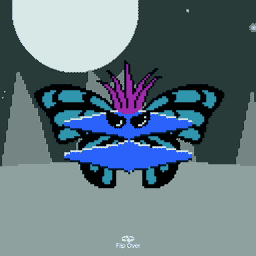
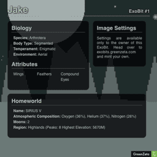

# \<gz-exobit\>
ExoBits are unique procedurally generated characters created with a pseudo random key. ExoBit keys are stored in the Ethereum blockchain and distributed as a Non Fungible Token (NFT). This web component loads ExoBit NFT metadata and renders an interactive card with image and information about the character.

Visit [exobits.com](https://exobits.greenzeta.com/) for more information on ExoBits and mint your own NFT.

 

## Scripts
- `npm run build` - Builds the web component javascript file, output to a `/dist` directory.

# Using This Project

## Setup

There are two methods for making the web component available in your project: installing from npm, or using a ``
- Once loaded, the script will automatically register the component and make it available for use.

## The Component Element

With the component script set up, you can add the component element to your project HTML. Adding the component is as simple as adding a `<gz-exobit></gz-exobit>` element to your page wherever you want the component to display. 

The component only requires one attribute `data-uri` which points to your ExoBit metadata. You can get the uri for your ExoBit NFT metadata from the ExoBits website. 
- Visit [exobits.com](https://exobits.greenzeta.com/) and connect your wallet. 
- Click the "My Exobits" navigation link at the top. 
- Choose the ExoBit you wish to add to your project. Below it there are several controls. The leftmost control is an input field containing the ipfs address for your ExoBit NFT metadata. If you have an ipfs capable browser, you can use this address to directly load your NFT metadata. However, most web browsers do not recognise the ipfs protocol. Therefore, you must use an http gateway to retrieve the metadata. Fortunately, one is provided.
- Next to the ipfs address is a button labeled `{...}`. This button will open a popup window with a url that displays your metadata. ExoBits uses the Pinata service and thier gateway. If you are fimilar with ipfs gateways and how they work, you're welcome to substitute your own.
- Copy the web address from the popup window, add a `data-uri` attribute to your `<gz-exobit>` element and set it equal to the address you copied. 
ex: `<gz-exobit data-uri="https://gateway.pinata.cloud/ipfs/QmPfKjX14CDY5VfsebwMJfGjujSJtGzASbcCRgEZ5x2yuw"></gz-exobit>`
- Optionally, you can set the size of your component using the `data-size` attribute. This can be set to any positive integer value. The component will render a square of that many pizels in length. Wile any size will work, the image will work best with a number that is an even multiple of 128 (ex. 128, 256, 512, 1024, etc). The default value is 512 and ExoBits were designed to be viewed at this size.
## Owner Features
In order to expose owner features, the component needs to communicate with the Ethereum contract. It is capable of doing this with the help of the web3 javascript library. Due to its size, the web3 library is not included in the component or this project. 

Visit the [web3.js project page](https://github.com/ChainSafe/web3.js) for more information on the library and setting it up in your project.

This component expects an instance of a `Web3` object assigned to a `web3instance` property of the window. ex: `window.web3instance = new Web3('ws://localhost:8546');`

This property must be set before the component element is added to the DOM. It also must have its active account set to the same address as the owner of the NFT matching the metadata provided via the component `data-uri` attribute.

Once set, the `<gz-exobit>` element may be added to the dom. If it detects a valid Web3 object in `window.web3instance` the component will automatically call out to the Ethereum contract and validate the NFT owner against the active account in the Web3 instance.